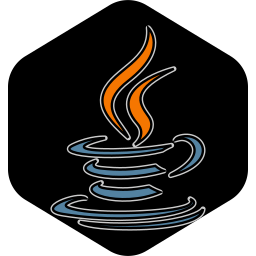

# RoadMap-Pessoal---JAVA-BACKEND
<sub>Repositório de documentação de estudos, criação de<br> uma biblioteca pessoal de conteúdo teórico e prático, de consulta pública.</sub>  
 
 <br>
<br> 

 Ao longo do ano de 2025 terminei minha graduação em Tecnologia em Análise e Desenvolvimento de Sistemas. Ao final dessa
 jornanda me deparei em uma incógnita: Não possuo especificação técnica. O currículo de uma graduação tende a ser o mais 
 generalista poissível, então torna-se comum que o aluno seja exposto a uma sére de linguagens e tecnologias - por vezes
 de forma superficial. 

 Eu já havia escolhido Java como carro-chefe de carreira, porém, por conta de dúvidas e - principalmente a famosa 
  _síndrome do impostor_ acabei perdendo o foco. 
 Agora, formado e em busca de recolocação, Java volta ao meu caminho como opção sólida e com mercado relativamente
 aquecido. 

 Esse repositório tem o objetivo de documentar meu desenvolvimento com a linguagem enquanto construo um portifolio de conhecimento. 
<br> 
<br>
```java
public class HelloWorld {

public static void main(String[] args) {

System.out.println("Olá, GitHub! Aqui começa minha jornada java pessoal!");
  }
}
```
 <br>
 
## Estrutura do Planejamento de Estudos

Não estipulei prazo, mas defini pequenos objetivos mediante a uma análise de algumas vagas em sites famosos de busca de emprego. 
Listei em um diagrama localmente e apresento abaixo a listagem de tópicos que apareceram com certa frequência noas buscas por vagas. 

--Não listei outras tecnologias como React que tem sido um diferencial em algumas posições de pleno em diante, como meu objetivo é inciiar 
esse repositório do início, não faz sentido expandir muito para fora do ecossistema do Java.--

A listagem é simples, organizada em tópico principal e subtópico. A ordem dos itens listados não necessáriamente é a melhor para o aprendizado.

| **Tópico** | **Subtópico** |
| :---: | :---: |
| Sintaxe | Tipos primitivos de dados, declarações simples, saídas de texto | 
| Classes e Objetos | O que é e para que serve uma classe/objeto, atributos e manipulação simples de atributos |
| Orientação a Objetos | Abstração - Herança - Polimorfismo e Encapsulamento | 
| Interface | Contratos de Implementação, Múltipla Implementação, Métodos e variáveis, Palavras Chave e Novidades Java + | 
| Interfaces e Classes Abstratas | Definição de comportamentos, abstrações entre outras questões dentro do código | 
| Estruturas de Dados  |  Arrays, ArrayLists, HashMaps, HashSet, Stacks, Queues, TreeSet e Treemap |
| Estruturas de Controle, Decisão e Repetição | If, Else, Switch, operador Ternário - For, For-each, While e do-While |
| Saber quando usar | Lists, Sets, Maps | 
| Diferença entre | ArrayList, LinkedList e HashMap | 
| Manipulação Eficiente | Strings, Lambdas, Multithreading e Concorrência | 
| Programação Funcional | Funções puras, Imutabilidade, Lambda, Interfaces Funcionais |
| Exceptions e JVM | Hierarquia de Exceptions, Try-Catch, Try Whith Resources, JVM: Garbage Collector e memória |
| JPA | ORM, Abstração, JPQL, Anotações | 
| JUnit | Testes Unitários | 
| Mockito | Simulações | <br>
<br>

> Apesar de _JUnit_ e _Mockito_ serem praticamente Frameworks - como o Springboot pelo que eu consegui pesquisar de forma superficial - vou considerar como
parte integrante do ciclo de aprendizado Java por aparecerem como requisitos de linguagem em algumas vagas, não como frameworks "diferenciais". <br>
<br>
<br>

## Framework
 
 <br>
<br>
<br>
<br>
O principal framework do Java na atualidade, é sem dúvidas o Spring, uma ferramenta de base Java - e de código aberto - que objetiva a implementação de aplicações Web e de Microsserviços sem a necessidade de complexidade desnecessária, versáteis e extremamente dinâmicos. Essa ferramenta se encaixa na proposta de estudo pois complementa uma série de habilidades relacionadas ao pensamento de um sistema completo, que integre por exemplo a um banco de dados relacional. Fora o adicional de por os pés no domínio da arquitetura de software enquanto se estuda Spring. 
<br>
<br>
<br>
<br>


| **Tópico** | **Subtópico** |
| :---: | :---: |
| SpringCore | IoC, Beans, AutoConfig, Starter e Dependencies, Spring Boot CLI & Initializr, Application Properties/YAML | 
| Spring Web | Rest e HTTP |
| Spring Data JPA | JPQL, Native e Query |
| Spring Security | Boot Starters, Auto configs, Actuator, Embedded Server, Hibernate |
| Bean Validation | Component, Sevice, Repository, Controller e escopos de bean | 
| Spring Data | JPA (Jakarta/ Java Persistence API) ORM, Entidades, Mapeamento, Interfaces | 
| Spring MVC | Model-View-Controller, DispatcherService, IoC, DI, Auto-configuração | 
<br>
<br> 
